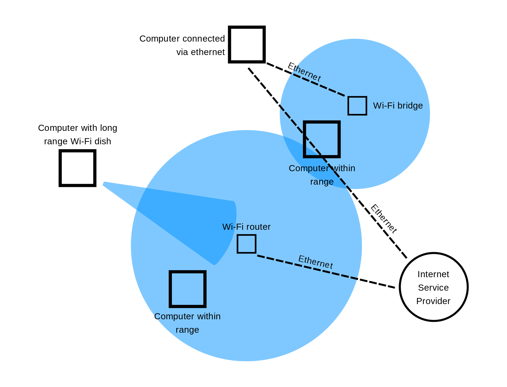
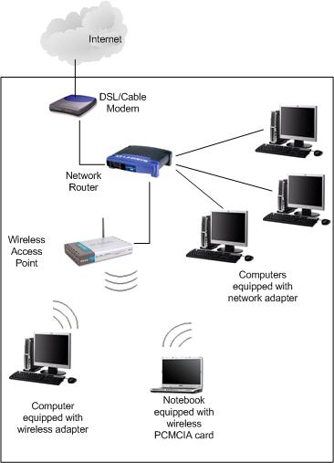
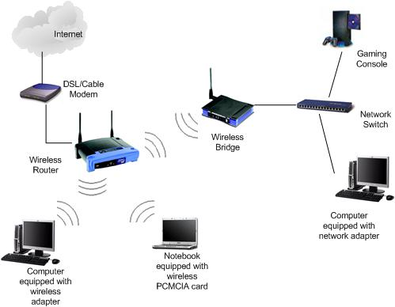
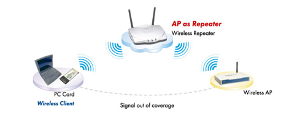
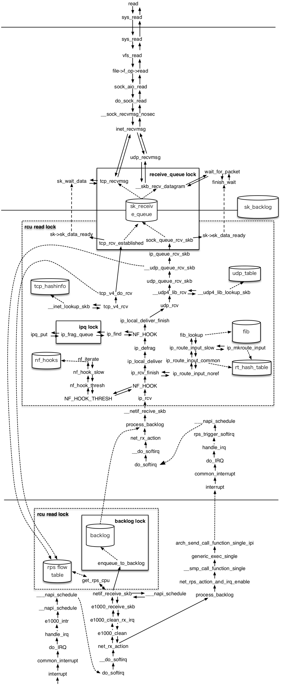
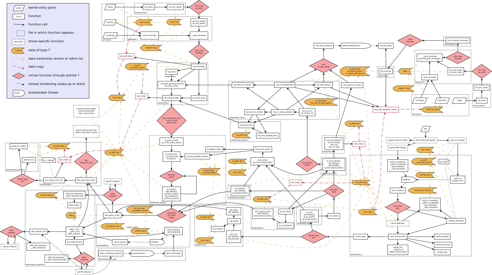
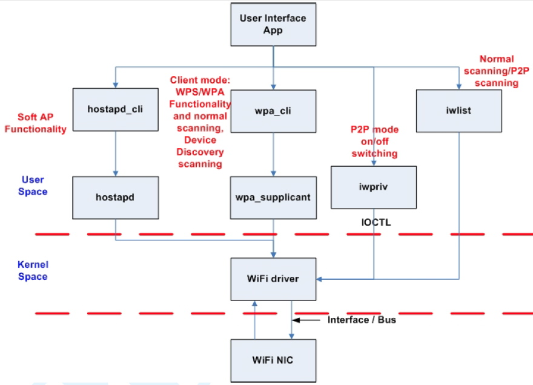
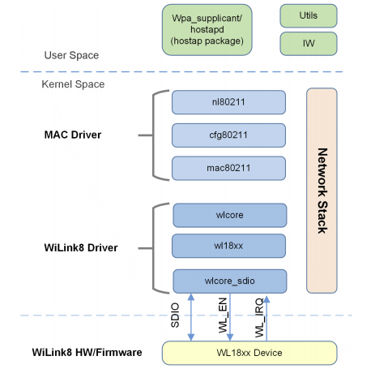
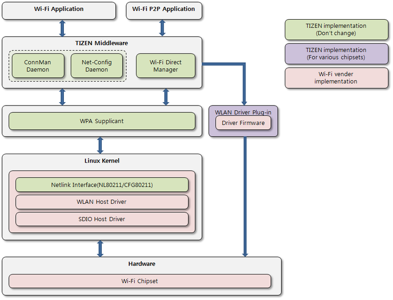
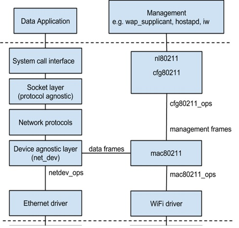

# WiFi KB & BKM

## Terminology and Concept

### WiFi

**Wi-Fi** or **WiFi** is a technology that allows electronic devices to connect to a wireless LAN (WLAN) network, mainly using the 2.4 gigahertz (12 cm) UHF and 5 gigahertz (6 cm) SHF ISM radio bands. A WLAN is usually password protected, but may be open, which allows any device within its range to access the resources of the WLAN network.

The Wi-Fi Alliance defines Wi-Fi as any "wireless local area network" (WLAN) product based on the Institute of Electrical and Electronics Engineers' (IEEE) 802.11 standards. However, the term "Wi-Fi" is used in general English as a synonym for "WLAN" since most modern WLANs are based on these standards. "Wi-Fi" is a trademark of the Wi-Fi Alliance. The "Wi-Fi Certified" trademark can only be used by Wi-Fi products that successfully complete Wi-Fi Alliance interoperability certification testing.

> https://en.wikipedia.org/wiki/Wi-Fi

### WLAN

A **Wireless Local Area Network (WLAN)** is a wireless computer network that links two or more devices using a wireless distribution method (often spread-spectrum or OFDM radio) within a limited area such as a home, school, computer laboratory, or office building. This gives users the ability to move around within a local coverage area and still be connected to the network, and can provide a connection to the wider Internet. Most modern WLANs are based on IEEE 802.11 standards, marketed under the Wi-Fi brand name.

> https://en.wikipedia.org/wiki/Wireless_LAN

### Station

In IEEE 802.11 (Wi-Fi) terminology, a **station (STA)** is a device that has the capability to use the 802.11 protocol.
For example, a station may be a laptop, a desktop PC, PDA, access point or Wi-Fi phone. An STA may be fixed, mobile or
portable. Generally in wireless networking terminology, a station, wireless client and node are often used
interchangeably, with no strict distinction existing between these terms. With a station also being referred as
transmitter or receiver based on its transmission characteristics.

IEEE 802.11-2007 formally defines station as:

*Any device that contains an IEEE 802.11-conformant media access control (MAC) and physical layer (PHY) interface to the wireless medium (WM).*

> https://en.wikipedia.org/wiki/Station_(networking)

### AP

In computer networking, a **Wireless Access Point (WAP)** is a networking hardware device that allows a Wi-Fi compliant
device to connect to a wired network. The WAP usually connects to a router (via a wired network) as a standalone device,
but it can also be an integral component of the router itself.

A WAP is differentiated from a hotspot, which is the physical location where Wi-Fi access to a WLAN is available.

> https://en.wikipedia.org/wiki/Wireless_access_point

### Router

A **router** is a networking device that forwards data packets between computer networks. Routers perform the "traffic directing" functions on the Internet. A data packet is typically forwarded from one router to another through the networks that constitute the internetwork until it reaches its destination node.

A router is connected to two or more data lines from different networks (as opposed to a network switch, which connects data lines from one single network). When a data packet comes in on one of the lines, the router reads the address information in the packet to determine its ultimate destination. Then, using information in its routing table or routing policy, it directs the packet to the next network on its journey. This creates an overlay internetwork.

> https://en.wikipedia.org/wiki/Router_(computing)

### Wireless Router

A **wireless router** is a device that performs the functions of a router and also includes the functions of a wireless access point. It is used to provide access to the Internet or a private computer network. It can function in a wired LAN (local area network), in a wireless-only LAN (WLAN), or in a mixed wired/wireless network, depending on the manufacturer and model.

> https://en.wikipedia.org/wiki/Wireless_router

### Hotspot

A **hotspot** is a physical location where people may obtain Internet access, typically using Wi-Fi technology, via a wireless local area network (WLAN) using a router connected to an internet service provider.

> https://en.wikipedia.org/wiki/Hotspot_(Wi-Fi)

### BSS

The **Basic Service Set (BSS)** is a set of all stations that can communicate with each other at PHY layer. Every BSS has an identification (ID) called the BSSID, which is the MAC address of the access point servicing the BSS.

The basic service set (BSS) provides the basic building-block of an 802.11 wireless LAN. In infrastructure mode, a single access point (AP) together with all associated stations (STAs) is called a BSS; not to be confused with the coverage of an access point, known as the basic service area (BSA). The access point acts as a master to control the stations within that BSS; the simplest BSS consists of one access point and one station.

### ESS

An **Extended Service Set (ESS)** is a set of two or more interconnected wireless BSSs that share the same SSID (network name), security credentials and integrated (providing translation between 802.3 and 802.11 frames) wired local area networks that appear as a single BSS to the logical link control layer at any station associated with one of those BSSs which facilitates mobile IP and fast secure roaming applications; the BSSs may work on the same channel, or work on different channels to boost aggregate throughput.

Access points in an ESS are connected by a distribution system. Each ESS has an ID called the SSID which is a 32-byte (maximum) character string.


> http://what-when-how.com/roaming-in-wireless-networks/wlan-overview-roamingcurrent-and-future-enhancements/

### SSID

Each BSS or ESS is identified by a **service set identifier (SSID)** - a series of 0 to 32 octets. It is used as an identifier for a wireless LAN, and is intended to be unique for a particular area. Since this identifier must often be entered into devices manually by a human user, it is often a human-readable string and thus commonly called the "network name"

### IEEE 802.11

**IEEE 802.11** is a set of media access control (MAC) and physical layer (PHY) specifications for implementing wireless local area network (WLAN) computer communication in the 900 MHz and 2.4, 3.6, 5, and 60 GHz frequency bands.

> https://en.wikipedia.org/wiki/IEEE_802.11

## Mode of Operation

The IEEE 802.11 has two basic modes of operation: **infrastructure mode** and **ad hoc mode**.
- **Infrastructure mode**, in which wireless clients are connected to an access point. This is generally the default mode for 802.11b cards.
- **Ad hoc mode**, in which clients are connected to one another without any access point.

> https://en.wikipedia.org/wiki/Wireless_LAN#Types_of_wireless_LANs

> http://ccm.net/contents/804-wifi-modes-of-operation-802-11-or-wi-fi

A wireless interface always operates in one of the following operating modes. The mode sets the main functionality of the wireless link.
- Access Point (AP) infrastructure mode
- Station infrastructure mode
- Monitor mode
- Ad-Hoc (IBSS) mode
- Wireless Distribution System (WDS)
- Mesh

### Access Point (AP) infrastructure mode

An Access Point acts as the Master device in a managed wireless network. It holds the network together by managing and maintaining lists of associated Stations. It also manages security policies. The network is named after the MAC-Address (BSSID) of the AP. The human readable name for the network, the SSID, is also set by the AP.

### Station infrastructure mode

The Station device connects to an access point by sending certain management packets to it. This process is called the authentication and association. After the AP sent the successful association reply, the station is part of the network.

### Monitor mode

Monitor mode is a passive-only mode, no packets are transmitted. All incoming packets are handed over to the host computer completely unfiltered. This mode is useful to see what's going on on the network.

With mac80211, it is possible to have a network device in monitor mode in addition to a regular device, this is useful to observe the network whilst using it. However, not all hardware fully supports this as not all hardware can be configured to show all packets while in one of the other operating modes, monitor mode interfaces always work on a “best effort” basis.

With mac80211, it's also possible to transmit packets in monitor mode, which is known as packet injection. This is useful for applications that wish to implement MLME work in userspace, for example to support nonstandard MAC extensions of IEEE 802.11.

### Ad-Hoc (IBSS) mode

The Ad-Hoc mode is used to create a wireless network without the need of having a Master Access Point in the network. Each station in an IBSS network is managing the network itself. Ad-Hoc is useful for connecting two or more computers to each other when no (useful) AP is around for this purpose.

### Wireless Distribution System (WDS)

The Distribution System is the wired uplink connection to an AP. The Wireless Distribution System is the wireless equivalent to it. WDS serves as a wireless communication path between cooperating APs (usually in a single ESS), it can be used instead of cabling.

### Mesh

Mesh interfaces are used to allow multiple devices to communication with each other by establishing intelligent routes between each other dynamically.

> https://wireless.wiki.kernel.org/en/users/Documentation/modes

> http://ccm.net/contents/804-wifi-modes-of-operation-802-11-or-wi-fi

## Infrastructure

**WLAN**



> https://upload.wikimedia.org/wikipedia/commons/thumb/d/df/WI-FI_Range_Diagram.svg/2000px-WI-FI_Range_Diagram.svg.png

**Wireless Router**



> http://www.crimewatchsecurity.com/image/101183000.jpg

**Wireless Bridge**



> http://www.home-network-help.com/wireless-bridge.html

**Wireless Repeater**



> http://www.eusso.com/models/wireless/ugl2454-apa/wireless%20repeater.jpg

## Standard Devices

### Wireless Access Point

A wireless access point (WAP) connects a group of wireless devices to an adjacent wired LAN. An access point resembles a network hub, relaying data between connected wireless devices in addition to a (usually) single connected wired device, most often an Ethernet hub or switch, allowing wireless devices to communicate with other wired devices.

### Wireless Adapter

Wireless adapters allow devices to connect to a wireless network. These adapters connect to devices using various external or internal interconnects such as PCI, miniPCI, USB, ExpressCard, Cardbus and PC Card.

### Wireless Router

Wireless routers integrate a Wireless Access Point, Ethernet switch, and internal router firmware application that provides IP routing, NAT, and DNS forwarding through an integrated WAN-interface. A wireless router allows wired and wireless Ethernet LAN devices to connect to a (usually) single WAN device such as a cable modem or a DSL modem. A wireless router allows all three devices, mainly the access point and router, to be configured through one central utility.

### Wireless Network Bridge

Wireless network bridges connect a wired network to a wireless network.

A bridge differs from an access point: an access point connects wireless devices to a wired network at the data-link layer.

Two wireless bridges may be used to connect two wired networks over a wireless link, useful in situations where a wired connection may be unavailable, such as between two separate homes or for devices which do not have wireless networking capability (but have wired networking capability), such as consumer entertainment devices; alternatively, a wireless bridge can be used to enable a device which supports a wired connection to operate at a wireless networking standard which is faster than supported by the wireless network connectivity feature (external dongle or inbuilt) supported by the device (e.g. enabling Wireless-N speeds (up to the maximum supported speed on the wired Ethernet port on both the bridge and connected devices including the wireless access point) for a device which only supports Wireless-G). A dual-band wireless bridge can also be used to enable 5 GHz wireless network operation on a device which only supports 2.4 GHz wireless networking functionality and has a wired Ethernet port.

### Wireless Repeater

Wireless range-extenders or wireless repeaters can extend the range of an existing wireless network. Strategically placed range-extenders can elongate a signal area or allow for the signal area to reach around barriers such as those pertaining in L-shaped corridors.

> https://en.wikipedia.org/wiki/Wi-Fi

## Protocol and Architecture

### General


> https://community.fs.com/blog/tcpip-vs-osi-whats-the-difference-between-the-two-models.html

<!--


> https://community.fs.com/blog/tcpip-vs-osi-whats-the-difference-between-the-two-models.html
-->


> https://vichargrave.github.io/programming/tcp-ip-network-programming-design-patterns-in-cpp/

### Linux Networking Stack

<!--


> http://140.120.7.21/LinuxRef/Network/LinuxNetworkStack.html
-->


> http://upload.wikimedia.org/wikipedia/commons/5/5b/Linux_kernel_map.png

> http://blog.erratasec.com/2013/02/custom-stack-it-goes-to-11.html#.V5itaGXXFZ0



> http://image.slidesharecdn.com/linuxnetworkstack-140928020340-phpapp02/95/linux-network-stack-1-1024.jpg?cb=1411869839



> https://openwrt.org/docs/guide-developer/networking/praxis

### Linux WiFi Architecture



> http://3.bp.blogspot.com/-e1LcVZ1CE0s/TxGnBSWMBXI/AAAAAAAAAGU/dalu2rx3OYw/s1600/WiFi+Direct.jpg

> http://dishingtech.blogspot.com/2012/01/realtek-wi-fi-direct-programming-guide.html

<!--


> http://processors.wiki.ti.com/index.php/WL18xx_Linux_Wireless_Architecture
-->



> https://www.ti.com/lit/ug/swru561a/swru561a.pdf?ts=1607093939535



> https://wiki.tizen.org/w/images/thumb/1/16/Wlan.png/800px-Wlan.png

> https://wiki.tizen.org/wiki/Porting_Guide/Connectivity

### Linux WiFi Kernel Stack Deep Dive

1. It's important to understand there are 2 paths in which userspace communicates with the kernel when we're talking about WiFi:
   - **Data path**: the data being received is passed from the wireless driver to the netdev core (usually using `netif_rx()`). From there the net core will pass it through the TCP/IP stack code and will queue it on the relevant sockets from which the userspace process will read it. On the Tx path packets will be sent from the netdev core to the wireless driver using the `ndo_start_xmit()` callback. The driver registers (like other netdevices such as an ethernet driver) a set of operations callbacks by using the `struct net_device_ops`.
   - **Control path**: this path is how userspace controls the WiFi interface/device and performs operations like **scan / authentication / association**. The userspace interface is based on netlink and called `nl80211` (see `include/uapi/linux/nl80211.h`). You can *send commands and get events in response*.
2. When you send an `nl80211` command it gets initially handled by `cfg80211` kernel module (it's code is under `net/wireless` and the handlers are in `net/wireless/nl80211.c`). `cfg80211` will usually call a lower level driver. In case of **Full MAC hardware** the specific HW driver is right below `cfg80211`. The driver below `cfg80211` registers a set of ops with `cfg80211` by using `cfg80211_ops struct`. For example see brcmfmac driver (`drivers/net/wireless/brcm80211/brcmfmac/wl_cfg80211.c`).
3. For **Soft MAC hardware** there's `mac80211` which is a kernel module implementing the 802.11 MAC layer. In this case `cfg80211` will talk to `mac80211` which will in turn use the hardware specific lower level driver. An example of this is iwlwifi (For Intel chips).
4. `mac80211` registers itself with `cfg80211` by using the `cfg80211_ops` (see `net/mac80211/cfg.c`). The specific HW driver registers itself with `mac80211` by using the `ieee80211_ops struct` (for example `drivers/net/wireless/iwlwifi/mvm/mac80211.c`).
5. Initialization of a new NIC you've connected occurs from the bottom up the stack. The HW specific driver will call mac80211's `ieee80211_allow_hw()` usually after probing the HW. `ieee80211_alloc_hw()` gets the size of private data struct used by the HW driver. It in turns calls `cfg80211` `wiphy_new()` which does the actual allocation of space sufficient for the wiphy struct, the `ieee80211_local struct` (which is used by `mac80211`) and the HW driver private data (the layering is seen in `ieee80211_alloc_hw` code).  `ieee80211_hw` is an embedded struct within `ieee80211_local` which is "visible" to the the HW driver. All of these (`wiphy`, `ieee80211_local`, `ieee80211_hw`) represent a single physical device connected.
6. On top of a single physical device (also referred to as phy) you can set up multiple virtual interfaces. These are essentially what you know as wlan0 or wlan1 which you control with `ifconfig`. Each such virtual interface is represented by an `ieee80211_vif`. This struct also contains at the end private structs accessed by the HW driver. Multiple interfaces can be used to run something like a station on wlan0 and an AP on wlan1 (this is possible depending on the HW capabilities).

> http://stackoverflow.com/questions/7157181/how-to-learn-the-structure-of-wireless-drivers-mac80211

**Linux Wireless Networking Architecutre Overview**



> https://www.linux.com/blog/linux-wireless-networking-short-walk

**Linux Wireless Networking Architecture - Old**


**Linux Wireless Networking Architecture - Current**


**Linux Wireless Networking Architecture - Planned**


> http://www.crifan.com/files/doc/docbook/linux_wireless/release/htmls/ch05_linux_wireless_lan_80211.html

**`nl80211` and `cfg80211`**


> http://stackoverflow.com/questions/21456235/how-nl80211-library-cfg80211-work

**More Details**


> http://wire-less-comm.blogspot.com/2013/01/wireless-lan-and-linux-together.html

### Inside Linux Kernel WiFi Source

> https://kernelnewbies.org/Documents/Kernel-Docbooks?action=AttachFile&do=get&target=mac80211_2.6.29.pdf

> http://www.campsmur.cat/files/mac80211_intro.pdf

### Android WiFI Architecture


>://mitulmodi.wordpress.com/2012/03/21/android-wifi-architecture-wext/

## Utilities

> http://archive.oreilly.com/linux/cmd/

> http://cb.vu/unixtoolbox.xhtml

> http://www.digilife.be/quickreferences/QRC/LINUX%20Admin%20Quick%20Reference.pdf

> https://sourceforge.net/projects/net-tools/

### Network Utilities

  ```
  ping, ping6 - send ICMP ECHO_REQUEST to network hosts

  # network interface manipulation
  ifconfig - configure a network interface
  ifup - bring a network interface up
  ifdown - take a network interface down
  ifquery - parse interface configuration
  iptables/ip6tables — administration tool for IPv4/IPv6 packet filtering and NA
  ip - show / manipulate routing, devices, policy routing and tunnels

  # driver and hardware
  ethtool - query or control network driver and hardware settings

  # routing
  route - show / manipulate the IP routing table
  netstat - Print network connections, routing tables, interface statistics, masquerade connections, and multicast memberships
  traceroute - print the route packets trace to network host
  tracepath, tracepath6 - traces path to a network host discovering MTU along this path

  # dns
  host - DNS lookup utility
  nslookup - query Internet name servers interactively
  dig - DNS lookup utility

  # wireless
  iwconfig - configure a wireless network interface

  # traffic
  tcpdump - dump traffic on a network
  tc - show / manipulate traffic control settings

  # swiss army knife
  nc (netcat) — arbitrary TCP and UDP connections and liste
  ```

### WiFi Utilities

  ```
  # wireless interface configure and manipulation
  iw - show / manipulate wireless devices and their configuration
  iwconfig - configure a wireless network interface
  iwevent - Display Wireless Events generated by drivers and setting changes
  iwgetid - Report ESSID, NWID or AP/Cell Address of wireless network
  iwlist - Get more detailed wireless information from a wireless interface
  iwpriv - configure optionals (private) parameters of a wireless network interface
  iwspy - Get wireless statistics from specific nodes

  rfkill - tool for enabling and disabling wireless devices

  # wireless access point
  wpa_cli - WPA command line client
  wpa_action - wpa_cli action script
  wpa_passphrase - Generate a WPA PSK from an ASCII passphrase for a SSID

  wpa_supplicant - Wi-Fi Protected Access client and IEEE 802.1X supplicant
  hostapd - IEEE 802.11 AP, IEEE 802.1X/WPA/WPA2/EAP/RADIUS Authenticator
  hostapd_cli - hostapd command-line interface

  # wpa_supplicant and hostapd come as a pair of complementary client and
  # host for wireless access points.
  # hostapd allows us to create access points from the command line, which
  # allows one to share one's internet connection wirelessly, while
  # wpa_supplicant allows us to scan and to connect to access points
  # as a client in order to get onto the Internet.
  ```

> https://en.wikipedia.org/wiki/Wireless_tools_for_Linux

> http://www.linuxjournal.com/content/wi-fi-command-line

### Deprecated Linux networking commands and their replacements

The command line utilities available for configuring and troubleshooting network properties on Windows and Linux, some Linux tools that, while still included and functional in many Linux distributions, are actually considered deprecated and therefore should be phased out in favor of more modern replacements.

Specifically, the deprecated Linux networking commands in question are: `arp`, `ifconfig`, `iptunnel`, `iwconfig`, `nameif`, `netstat`, and `route`.
These programs (except `iwconfig`) are included in the net-tools package that has been unmaintained for years.

Deprecated command | Replacement command(s)
-----              | ------
arp                | ip n (ip neighbor)
ifconfig           | ip a (ip addr), ip link, ip -s (ip -stats)
iptunnel           | ip tunnel
iwconfig           | iw
nameif             | ip link, ifrename
netstat            | ss, ip route (for netstat-r), ip -s link (for netstat -i), ip maddr (for netstat-g)
route              | ip r (ip route)

> https://dougvitale.wordpress.com/2011/12/21/deprecated-linux-networking-commands-and-their-replacements/

> https://dougvitale.wordpress.com/2011/12/11/troubleshooting-faulty-network-connectivity-part-2-essential-network-commands/

### `ip`

`ifconfig` will not go away any time soon, but its newer version, `ip`, is more powerful and will eventually replace it.

  ```
  ip [ OPTIONS ] OBJECT { COMMAND | help }

  ip [ -force ] -batch filename

  OBJECT := { link | addr | addrlabel | route | rule | neigh | ntable | tunnel | tuntap | maddr | mroute | mrule | monitor | xfrm | netns | l2tp | tcp_metrics }

  OPTIONS := { -V[ersion] | -s[tatistics] | -r[esolve] | -f[amily] { inet | inet6 | ipx | dnet | link } | -o[neline] }
  ```

`ip` is not a drop-in replacement for `ifconfig`. There are differences in the structure of the commands. Even with these differences, both commands are used for similar purposes.

In fact, `ip` can do the following:
- Discover which interfaces are configured on a system
- Query the status of a network interface
- Configure the network interfaces (including local loop-back, and Ethernet)
- Bring an interface up or down
- Manage both default and static routing
- Configure tunnel over IP
- Configure ARP or NDISC cache entry

> https://www.linux.com/learn/replacing-ifconfig-ip

> http://superuser.com/questions/239706/ip-versus-ifconfig

> https://tty1.net/blog/2010/ifconfig-ip-comparison_en.html

### `iwconfig`, `iwevent`, `iwlist`

  ```
  iwconfig [interface]
  iwconfig interface [essid X] [nwid N] [mode M] [freq F]
                     [channel C][sens S ][ap A ][nick NN ]
                     [rate R] [rts RT] [frag FT] [txpower T]
                     [enc E] [key K] [power P] [retry R]
                     [modu M] [commit]
  ```

`iwconfig` is similar to `ifconfig`, but is dedicated to the wireless interfaces.
It is used to set the parameters of the network interface which are specific to the wireless operation (for example : the frequency).
`iwconfig` may also be used to display those parameters, and the wireless statistics (extracted from `/proc/net/wireless`).

`iwevent` displays Wireless Events received through the RTNetlink socket.
Each line displays the specific Wireless Event which describes what has happened on the specified wireless interface.

  ```
  iwlist [interface] scanning
  iwlist [interface] frequency
  iwlist [interface] rate
  iwlist [interface] keys
  iwlist [interface] power
  iwlist [interface] txpower
  iwlist [interface] retry
  iwlist [interface] event
  iwlist [interface] auth
  iwlist [interface] wpakeys
  iwlist [interface] genie
  iwlist [interface] modulation
  ```

`iwlist` is used to display some additional information from a wireless network interface that is not displayed by `iwconfig`.
The main argument is used to select a category of information, `iwlist` displays in detailed form all information related to this category, including information already shown by `iwconfig`.

### `iw`

`iw` is a new `nl80211` based CLI configuration utility for wireless devices.
It supports all new drivers that have been added to the kernel recently.
The old tool `iwconfing`, which uses Wireless Extensions interface, is deprecated and it's strongly recommended to switch to `iw` and `nl80211`.

Like rest of Linux kernel, `iw` is still under development. Features are added 'as we go'.
The only documentation for `iw` is this page and output from 'iw help'. 

> https://wireless.wiki.kernel.org/en/users/documentation/iw

> https://wireless.wiki.kernel.org/en/users/documentation/iw/replace-iwconfig

### `wpa_supplicant`

  ```
  wpa_supplicant [ -BddfhKLqqtuvW ] [ -iifname ] [ -cconfig file ] [ -Ddriver ] [ -PPID_file ] [ -foutput file ]
  ```

**`wpa_supplicant`** is an implementation of the WPA Supplicant component, i.e., the part that runs in the client stations. It implements WPA key negotiation with a WPA Authenticator and EAP authentication with Authentication Server. In addition, it controls the roaming and IEEE 802.11 authentication/association of the wireless LAN driver.

**`wpa_supplicant`** is designed to be a "daemon" program that runs in the background and acts as the backend component controlling the wireless connection. `wpa_supplicant` supports separate frontend programs and an example text-based frontend, `wpa_cli`, is included with `wpa_supplicant`.

Before `wpa_supplicant` can do its work, the network interface must be available. That means that the physical device must be present and enabled, and the driver for the device must be loaded. The daemon will exit immediately if the device is not already available.


**Examples**

In most common cases, wpa_supplicant is started with:

  ```
  wpa_supplicant -B -c/etc/wpa_supplicant.conf -iwlan0
  ```

This makes the process fork into background.

The easiest way to debug problems, and to get debug log for bug reports, is to start wpa_supplicant on foreground with debugging enabled:

  ```
  wpa_supplicant -c/etc/wpa_supplicant.conf -iwlan0 -d
  ```

If the specific driver wrapper is not known beforehand, it is possible to specify multiple comma separated driver wrappers on the command line. wpa_supplicant will use the first driver wrapper that is able to initialize the interface.

  ```
  wpa_supplicant -Dnl80211,wext -c/etc/wpa_supplicant.conf -iwlan0
  ```

`wpa_supplicant` can control multiple interfaces (radios) either by running one process for each interface separately or by running just one process and list of options at command line. Each interface is separated with -N argument. As an example, following command would start wpa_supplicant for two interfaces:

  ```
  wpa_supplicant \
      -c wpa1.conf -i wlan0 -D hostap -N \
      -c wpa2.conf -i ath0 -D madwifi
  ```

> http://linux.die.net/man/8/wpa_supplicant

> https://wiki.archlinux.org/index.php/WPA_supplicant

> https://ubuntuforums.org/showthread.php?t=263136

### `wpa_cli`

  ```
  wpa_cli [ -p path to ctrl sockets ] [ -i ifname ] [ -hvB ] [ -a action file ] [ -P pid file ] [ command ... ]
  ```

`wpa_cli` is a text-based frontend program for interacting with `wpa_supplicant`. It is used to query current status, change configuration, trigger events, and request interactive user input.

**Examples**

> https://gist.github.com/buhman/7162560

> http://linux.die.net/man/8/wpa_cli

### `hostapd`, `hostapd_cli`

`hostapd` is a user space daemon for access point and authentication servers. It implements IEEE 802.11 access point management, IEEE 802.1X/WPA/WPA2/EAP Authenticators, RADIUS client, EAP server, and RADIUS authentication server. The current version supports Linux (Host AP, madwifi, mac80211-based drivers) and FreeBSD (net80211).

`hostapd` is designed to be a "daemon" program that runs in the background and acts as the backend component controlling authentication. `hostapd` supports separate frontend programs and an example text-based frontend, `hostapd_cli`, is included with `hostapd`.

> https://w1.fi/hostapd/

> https://wireless.wiki.kernel.org/en/users/documentation/hostapd

> https://wiki.gentoo.org/wiki/Hostapd

> https://wiki.archlinux.org/index.php/software_access_point

### Reference

> http://askubuntu.com/questions/138472/how-do-i-connect-to-a-wpa-wifi-network-using-the-command-line

> http://sirlagz.net/2012/08/27/how-to-use-wpa_cli-to-connect-to-a-wireless-network/

> http://sirlagz.net/2012/08/27/how-to-use-wpa_cli-to-connect-to-a-wireless-network/

> http://linux.icydog.net/wpa.php


## Configuration

### Linux Network Interface

#### `/sys/class/net/...`

  ```
  $ tree /sys/class/net
  /sys/class/net
  |-- eth0 -> ../../devices/pci0000:00/0000:00:03.0/net/eth0
  +-- lo -> ../../devices/virtual/net/lo

  $ ls -l /sys/class/net/eth0/
  total 0
  -r--r--r-- 1 root root 4096  7月 25 18:40 addr_assign_type
  -r--r--r-- 1 root root 4096  7月 25 18:40 address
  -r--r--r-- 1 root root 4096  7月 28 14:48 addr_len
  -r--r--r-- 1 root root 4096  7月 28 14:48 broadcast
  -rw-r--r-- 1 root root 4096  7月 28 14:48 carrier
  -r--r--r-- 1 root root 4096  7月 28 14:48 carrier_changes
  lrwxrwxrwx 1 root root    0  7月 25 18:40 device -> ../../../0000:00:03.0
  -r--r--r-- 1 root root 4096  7月 25 18:40 dev_id
  -r--r--r-- 1 root root 4096  7月 28 14:48 dev_port
  -r--r--r-- 1 root root 4096  7月 28 14:48 dormant
  -r--r--r-- 1 root root 4096  7月 28 14:48 duplex
  -rw-r--r-- 1 root root 4096  7月 28 14:48 flags
  -rw-r--r-- 1 root root 4096  7月 28 14:48 gro_flush_timeout
  -rw-r--r-- 1 root root 4096  7月 28 14:48 ifalias
  -r--r--r-- 1 root root 4096  7月 25 18:40 ifindex
  -r--r--r-- 1 root root 4096  7月 25 18:40 iflink
  -r--r--r-- 1 root root 4096  7月 28 14:48 link_mode
  -rw-r--r-- 1 root root 4096  7月 28 14:48 mtu
  -r--r--r-- 1 root root 4096  7月 28 14:48 name_assign_type
  -rw-r--r-- 1 root root 4096  7月 28 14:48 netdev_group
  -r--r--r-- 1 root root 4096  7月 28 14:48 operstate
  -r--r--r-- 1 root root 4096  7月 28 14:48 phys_port_id
  -r--r--r-- 1 root root 4096  7月 28 14:48 phys_switch_id
  drwxr-xr-x 2 root root    0  7月 28 14:48 power
  drwxr-xr-x 4 root root    0  7月 25 18:40 queues
  -r--r--r-- 1 root root 4096  7月 28 14:48 speed
  drwxr-xr-x 2 root root    0  7月 28 14:48 statistics
  lrwxrwxrwx 1 root root    0  7月 25 18:40 subsystem -> ../../../../../class/net
  -rw-r--r-- 1 root root 4096  7月 28 14:48 tx_queue_len
  -r--r--r-- 1 root root 4096  7月 25 18:40 type
  -rw-r--r-- 1 root root 4096  7月 25 18:40 uevent
  ```

Description and explaination of those files under `/sys/class/net/` can be found at https://www.kernel.org/doc/Documentation/ABI/testing/sysfs-class-net.

> https://wiki.archlinux.org/index.php/Network_configuration

#### `/proc/net/...`

 ```
 $ ls -l /proc/net/
 total 0
 -r--r--r-- 1 root root 0  7月 29 13:34 anycast6
 -r--r--r-- 1 root root 0  7月 29 13:34 arp
 -r--r--r-- 1 root root 0  7月 29 13:34 bnep
 -r--r--r-- 1 root root 0  7月 29 13:34 connector
 -r--r--r-- 1 root root 0  7月 29 13:34 dev
 -r--r--r-- 1 root root 0  7月 29 13:34 dev_mcast
 dr-xr-xr-x 2 root root 0  7月 29 13:34 dev_snmp6
 -r--r--r-- 1 root root 0  7月 29 13:34 fib_trie
 -r--r--r-- 1 root root 0  7月 29 13:34 fib_triestat
 -r--r--r-- 1 root root 0  7月 29 13:34 hci
 -r--r--r-- 1 root root 0  7月 29 13:34 icmp
 -r--r--r-- 1 root root 0  7月 29 13:34 icmp6
 -r--r--r-- 1 root root 0  7月 29 13:34 if_inet6
 -r--r--r-- 1 root root 0  7月 29 13:34 igmp
 -r--r--r-- 1 root root 0  7月 29 13:34 igmp6
 -r--r--r-- 1 root root 0  7月 29 13:34 ip6_flowlabel
 -r--r--r-- 1 root root 0  7月 29 13:34 ip6_mr_cache
 -r--r--r-- 1 root root 0  7月 29 13:34 ip6_mr_vif
 -r--r--r-- 1 root root 0  7月 29 13:34 ip_mr_cache
 -r--r--r-- 1 root root 0  7月 29 13:34 ip_mr_vif
 -r--r--r-- 1 root root 0  7月 29 13:34 ipv6_route
 -r--r--r-- 1 root root 0  7月 29 13:34 l2cap
 -r--r--r-- 1 root root 0  7月 29 13:34 mcfilter
 -r--r--r-- 1 root root 0  7月 29 13:34 mcfilter6
 dr-xr-xr-x 2 root root 0  7月 29 13:34 netfilter
 -r--r--r-- 1 root root 0  7月 29 13:34 netlink
 -r--r--r-- 1 root root 0  7月 29 13:34 netstat
 -r--r--r-- 1 root root 0  7月 29 13:34 packet
 -r--r--r-- 1 root root 0  7月 29 13:34 pnp
 -r--r--r-- 1 root root 0  7月 29 13:34 protocols
 -r--r--r-- 1 root root 0  7月 29 13:34 psched
 -r--r--r-- 1 root root 0  7月 29 13:34 ptype
 -r--r--r-- 1 root root 0  7月 29 13:34 raw
 -r--r--r-- 1 root root 0  7月 29 13:34 raw6
 -r--r--r-- 1 root root 0  7月 29 13:34 rfcomm
 -r--r--r-- 1 root root 0  7月 29 13:34 route
 -r--r--r-- 1 root root 0  7月 29 13:34 rt6_stats
 -r--r--r-- 1 root root 0  7月 29 13:34 rt_acct
 -r--r--r-- 1 root root 0  7月 29 13:34 rt_cache
 -r--r--r-- 1 root root 0  7月 29 13:34 sco
 -r--r--r-- 1 root root 0  7月 29 13:34 snmp
 -r--r--r-- 1 root root 0  7月 29 13:34 snmp6
 -r--r--r-- 1 root root 0  7月 29 13:34 sockstat
 -r--r--r-- 1 root root 0  7月 29 13:34 sockstat6
 -r--r--r-- 1 root root 0  7月 29 13:34 softnet_stat
 dr-xr-xr-x 2 root root 0  7月 29 13:34 stat
 -r--r--r-- 1 root root 0  7月 29 13:34 tcp
 -r--r--r-- 1 root root 0  7月 29 13:34 tcp6
 -r--r--r-- 1 root root 0  7月 29 13:34 udp
 -r--r--r-- 1 root root 0  7月 29 13:34 udp6
 -r--r--r-- 1 root root 0  7月 29 13:34 udplite
 -r--r--r-- 1 root root 0  7月 29 13:34 udplite6
 -r--r--r-- 1 root root 0  7月 29 13:34 unix
 -r--r--r-- 1 root root 0  7月 29 13:34 wireless
 -r--r--r-- 1 root root 0  7月 29 13:34 xfrm_stat
 ```

This directory provides a comprehensive look at various networking parameters and statistics.
Each directory and virtual file within this directory describes aspects of the system's network configuration.

Below is a partial list of the `/proc/net/` directory:

- **arp** - Lists the kernel's ARP table.

  This file is particularly useful for connecting a hardware address to an IP address on a system.

- **atm/** — The files within this directory contain Asynchronous Transfer Mode (ATM) settings and statistics.

  This directory is primarily used with ATM networking and ADSL cards.

- **dev** - Lists the various network devices configured on the system, complete with transmit and receive statistics.

  This file displays the number of bytes each interface has sent and received, the number of packets inbound and outbound, the number of errors seen, the number of packets dropped, and more.

- **dev_mcast** - Lists Layer2 multicast groups on which each device is listening.
- **igmp** - Lists the IP multicast addresses which this system joined.
- **ip_conntrack** - Lists tracked network connections for machines that are forwarding IP connections.
- **ip_tables_names** - Lists the types of iptables in use.
  This file is only present if iptables is active on the system and contains one or more of the following values: filter, mangle, or nat.
- **ip_mr_cache** - Lists the multicast routing cache.
- **ip_mr_vif** - Lists multicast virtual interfaces.
- **netstat** - Contains a broad yet detailed collection of networking statistics, including TCP timeouts, SYN cookies sent and received, and much more.
- **psched** - Lists global packet scheduler parameters.
- **raw** - Lists raw device statistics.
- **route** - Lists the kernel's routing table.
- **rt_cache** - Contains the current routing cache.
- **snmp** - List of Simple Network Management Protocol (SNMP) data for various networking protocols in use.
- **sockstat** - Provides socket statistics.
- **tcp** - Contains detailed TCP socket information.
- **tr_rif** - Lists the token ring RIF routing table.
- **udp** - Contains detailed UDP socket information.
- **unix** - Lists UNIX domain sockets currently in use.
- **wireless** - Lists wireless interface data.

> https://www.centos.org/docs/5/html/5.2/Deployment_Guide/s2-proc-dir-net.html

### Linux Network Config Files

  ```
  /etc/network/interfaces
  /etc/networks
  /etc/protocols
  /etc/services
  /etc/host.conf
  /etc/hostname
  /etc/hosts
  /etc/hosts.allow
  /etc/hosts.den
  /etc/resolv.conf
  ```

`/etc/network/interfaces` contains network interface configuration
information for the `ifup` and `ifdown` commands.

This is where you configure how your system is connected to the
network.

`/etc/networks` is a plain ASCII file that describes known DARPA
networks and symbolic names for these networks.

### Android WiFi Config Files

  ```
  /system/etc/wifi/wpa_supplicant.conf
  /data/misc/wifi/wpa_supplicant.conf
  /data/data/com.android.providers.settings/databases/settings.db
  ```

  ```
  # Start wpa_supplicant

  # Android socket
  service wpa_supplicant /system/bin/wpa_supplicant \
        -iwlan0 -Dnl80211 -c/data/misc/wifi/wpa_supplicant.conf \
        -e/data/misc/wifi/entropy.bin -ddd
        class main
        socket wpa_wlan0 dgram 660 wifi wifi # <- With this line you specify that is an Android socket, note the keyword "socket"
        disabled
        oneshot

  # Unix socket
  service wpa_supplicant /system/bin/wpa_supplicant \
        -iwlan0 -Dnl80211 -c/data/misc/wifi/wpa_supplicant.conf \
        disabled
        oneshot
  ```

> http://forum.xda-developers.com/showthread.php?t=2547690

  ```
  # Regist hostap

  service hostapd_bin /system/bin/hostapd -d /data/misc/wifi/hostapd.conf
        socket wpa_wlan0 dgram 660 wifi wifi
        disabled
        oneshot
  ```

> http://processors.wiki.ti.com/index.php/TI-Android-JB-PortingGuide#WLAN

### Reference

> https://help.ubuntu.com/12.04/serverguide/network-configuration.html

> https://wiki.debian.org/NetworkConfiguration

> https://wiki.archlinux.org/index.php/Network_configuration

## WiFi for IoT

### Smart-Config

TI's SimpleLink Wi-Fi CC3000 module comes with TI's unique SmartConfig technology, a one-step Wi-Fi setup process that allows multiple in-home devices to connect to Wi-Fi networks quickly and efficiently. Considering applications that typically do not have a display or keyboard to enter Wi-Fi network name and password, SmartConfig technology gives end users the ability to easily connect their CC3000-based devices to an access point. Through a simple SmartConfig technology interface, consumers can use an iOS or Android smartphone/tablet or home PC using just a simple Web browser. Software on this page gives access to the SmartConfig library and application source code in order to create your own application using TI's SmartConfig technology.


> http://processors.wiki.ti.com/index.php/CC3000_Smart_Config

> http://processors.wiki.ti.com/index.php/CC3000_First_Time_Configuration

> http://electronics.stackexchange.com/questions/61704/how-does-ti-cc3000-wifi-smart-config-work

> http://depletionregion.blogspot.com/2013/10/cc3000-smart-config-transmitting-ssid.html

> http://depletionregion.blogspot.ch/2014/06/smart-config-for-consumer-products.html

> http://www.tuicool.com/articles/E3a2myi

> http://blog.csdn.net/xundh/article/details/50351888

### Configure IoT WiFi


> https://www.linkedin.com/pulse/wifi-configuration-iot-devices-dan-walkes

**AP Mode**

- Config IoT WiFi thru AP

<!--


> http://www.jxtobo.com/4572.html
-->

**Smart Config**

<!--

-->

**Air Kiss**

AirKiss是微信硬件平台提供的一种WIFI设备快速入网配置技术，要使用微信客户端的方式配置设备入网，需要设备支持AirKiss技术。

AirKiss主要在如下场景中使用：

- 待接入互联网的设备不具备输入输出能力，如空调、空气净化器、烟雾报警器等。
- 用户不具备通过设备热点的方式进行配置的能力，如老人、家庭主妇等缺乏相关IT知识的用户人群。

<!--

-->

> http://iot.weixin.qq.com/wiki/document-7_1.html

> http://iot.weixin.qq.com/wiki/doc/wifi/AirKissDoc.pdf

> http://iot.weixin.qq.com/wiki/airkiss_developer_manual.pdf

> http://wenku.baidu.com/view/0e825981ad02de80d5d8409c

> http://iot.weixin.qq.com/wiki/document-0_4.html

## Misc


## Reference

- https://en.wikipedia.org/wiki/Wi-Fi
- http://standards.ieee.org/getieee802/download/802.11-2007.pdf
- http://www.slideshare.net/hugolu/the-linux-networking-architecture
- https://wireless.wiki.kernel.org/welcome
- http://linuxwireless.org/attachments/en/developers/Documentation/overview.pdf
- https://wireless.wiki.kernel.org/_media/en/developers/documentation/mac80211.pdf
- http://disi.unitn.it/locigno/didattica/NC/10-11/Slides_Seminar_Gringoli.pdf
- [Inside the Atheros WiFi Chipset - Adrian Chadd](https://www.youtube.com/watch?v=WOcYTqoSQ68)
- http://2010.rmll.info/IMG/pdf/kernel-device-drivers-rmll2010.pdf
- https://www.scribd.com/doc/152763476/Linux-Wifi-Developer-Guide-1
- https://wiki.archlinux.org/index.php/Wireless_network_configuration
- https://wiki.openwrt.org/doc/uci/wireless
- https://dougvitale.wordpress.com/2011/12/21/deprecated-linux-networking-commands-and-their-replacements/
